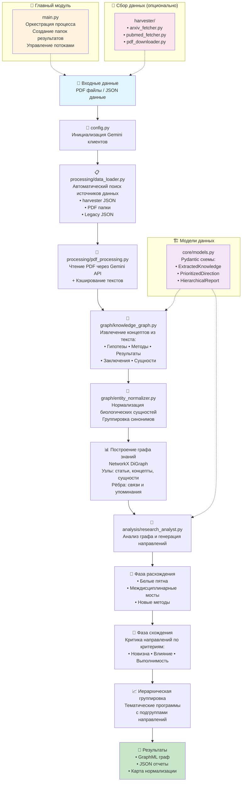

# 🧬 LCGR - Longevity Research Graph Analyzer

Интеллектуальная система анализа графа знаний для автоматического поиска перспективных направлений в исследованиях долголетия. Использует графовые алгоритмы и ИИ для выявления белых пятен, междисциплинарных связей и приоритизации исследовательских идей.

## 🚀 Быстрый старт

```bash
# Установка зависимостей
pip install -r requirements.txt

# Настройка API ключа Gemini
export GOOGLE_API_KEY=your_api_key_here

# Запуск полного анализа
python main.py
```

## 🏗️ Архитектура системы

Система построена по модульному принципу с четким разделением ответственности:

### 📊 Диаграмма потока данных



### 📁 Структура модулей

```
main_pipeline/
├── main.py                  # 🚀 Оркестратор: управление процессом и результатами
├── config.py                # 🔧 Конфигурация: инициализация Gemini клиентов
├── core/
│   └── models.py            # 📋 Модели данных: Pydantic схемы
├── processing/
│   ├── data_loader.py       # 📂 Загрузчик: поиск и загрузка данных из разных источников
│   └── pdf_processing.py    # 📄 PDF-процессор: чтение через Gemini + кэширование
├── graph/
│   ├── knowledge_graph.py   # 📊 Конструктор графа: извлечение концептов и построение
│   └── entity_normalizer.py # 🔗 Нормализатор: группировка синонимов сущностей
├── analysis/
│   └── research_analyst.py  # 🔬 Аналитик: генерация и приоритизация направлений
└── harvester/               # 📡 Сборщики данных (опционально)
    ├── arxiv_fetcher.py
    ├── pubmed_fetcher.py
    └── pdf_downloader.py
```

## 🔄 Принципы работы системы

### Фаза 1: Инициализация и настройка (`config.py`)

**Идея**: Централизованная настройка ИИ-клиентов с оптимизацией по задачам

- ✅ Проверяет наличие `GOOGLE_API_KEY` и корректность доступа
- ✅ Инициализирует специализированных клиентов:
  - `gemini-2.0-flash` → быстрое извлечение концептов (производительность)
  - `gemini-2.5-flash` → сложная критика и анализ (качество)
- ✅ Автоматическая обработка ошибок и fallback стратегии

### Фаза 2: Умная загрузка данных (`processing/data_loader.py`)

**Идея**: Автоматическое определение лучшего источника данных с приоритизацией

Система ищет данные в порядке убывания приоритета:

1. **Файлы harvester** (`lcgr_ready_*.json`) - богатые данные с PDF и метаданными
2. **Папки с PDF** (`downloaded_pdfs/`) - прямая обработка научных статей
3. **Legacy JSON** (`pubmed_corpus.json`) - совместимость со старыми форматами
4. **Тестовые данные** - для демонстрации возможностей

**Ключевые особенности**:
- 🚀 **Параллельная обработка**: до 30 PDF одновременно
- 🧠 **Умный fallback**: если PDF недоступен → использует аннотацию
- 📊 **Прогресс-бары**: визуальный контроль процесса

### Фаза 3: Интеллектуальная обработка PDF (`processing/pdf_processing.py`)

**Идея**: Прямое извлечение структурированных знаний из PDF без промежуточных этапов

```
📄 PDF → 🧠 Gemini API → 🔍 Структурированные концепты
```

**Революционный подход**:
- ❌ **НЕ делаем**: PDF → текст → анализ текста  
- ✅ **Делаем**: PDF → сразу извлечение концептов и сущностей

**Технологические решения**:
- 💾 **Умное кэширование**: избегает повторной обработки одинаковых файлов
- 🔒 **Потокобезопасность**: блокировки для параллельной работы
- 🎯 **Специализированные промпты**: разные стратегии для разных типов задач

### Фаза 4: Построение графа знаний (`graph/knowledge_graph.py`)

**Идея**: Граф как универсальная структура для представления научных знаний

**Архитектура графа**:
```
🗂️ Paper (статья)
├── 💡 Hypothesis (гипотеза)
├── 🔬 Method (метод)  
├── 📈 Result (результат)
└── 💭 Conclusion (заключение)
    └── 🧬 Entity (биологическая сущность)
```

**Извлекаемые элементы**:
- **Гипотезы** - научные предположения для проверки
- **Методы** - экспериментальные подходы и техники
- **Результаты** - наблюдения, данные, измерения
- **Заключения** - интерпретации и выводы авторов
- **Сущности** - гены, белки, болезни, соединения, процессы

**Связи в графе**:
- `Paper → Concept` (CONTAINS): статья содержит концепт
- `Concept → Entity` (MENTIONS): концепт упоминает сущность
- `Entity → Entity` (NORMALIZED_TO): синонимы указывают на каноническую форму

### Фаза 5: Нормализация сущностей (`graph/entity_normalizer.py`)

**Идея**: ИИ-агент для разрешения синонимов и создания единого пространства имен

**Проблема**: `mTOR`, `mechanistic target of rapamycin`, `FRAP1` - это одна сущность!

**Решение**:
1. 📋 Сбор всех уникальных имен сущностей из всех документов
2. 🧠 LLM-группировка синонимов в кластеры 
3. 🎯 Выбор канонического представителя каждого кластера
4. 💾 Создание карты нормализации для быстрого поиска

**Результат**: вместо 1000 разрозненных имен → 300 нормализованных сущностей

### Фаза 6: Интеллектуальный анализ (`analysis/research_analyst.py`)

**Идея**: Двухфазный анализ по принципу "расхождение → схождение"

#### 🌟 Фаза расхождения: Генерация исследовательских идей

**1. Поиск "белых пятен"**
- Алгоритм: находит гипотезы без экспериментальных подтверждений
- Синтез: ИИ-агент создает исследовательские предложения на основе недоказанных гипотез

**2. Междисциплинарные мосты**  
- Алгоритм: ищет общие сущности в разных статьях
- Синтез: предлагает новые связи между разными областями исследований

**3. Применение новых методов**
- Алгоритм: комбинирует современные методы с нерешенными проблемами
- Синтез: предлагает свежие подходы к известным задачам

#### 🎯 Фаза схождения: Критическая оценка

Каждое направление оценивается ИИ-критиком по трем осям:

- **Новизна** (0-10): насколько это новая научная парадигма
- **Влияние** (0-10): потенциал изменить область исследований  
- **Выполнимость** (0-10): реалистичность реализации с текущими технологиями

**Финальная формула**: `Скор = 0.5×Влияние + 0.3×Новизна + 0.2×Выполнимость`

#### 📈 Иерархическая группировка v2.0

Система автоматически объединяет родственные направления в стратегические программы:

```
📋 Стратегическая программа "Митохондриальное долголетие"
├── 🔬 Фундаментальные механизмы (3 идеи)
├── ✅ Валидация гипотез (5 идей)  
└── 🛠️ Методологические применения (2 идеи)
```

### Фаза 7: Результаты и артефакты

**Файлы для дальнейшего использования**:
- `longevity_knowledge_graph.graphml` → граф для Gephi, Cytoscape
- `hierarchical_research_report.json` → структурированный анализ v2.0
- `research_report.json` → legacy формат для совместимости
- `entity_normalization_map.json` → карта синонимов для повторного использования

## 📊 Поддерживаемые форматы входных данных

### 1. Harvester формат (рекомендуется)
```json
{
  "paper_123": {
    "title": "Novel senescence mechanisms in aging",
    "abstract": "This study investigates...",
    "year": 2024,
    "has_pdf": true,
    "pdf_path": "downloaded_pdfs/paper_123.pdf",
    "full_text": "Optional preprocessed text..."
  }
}
```

### 2. Папка с PDF файлами
```
downloaded_pdfs/
├── aging_mechanisms_2024.pdf
├── longevity_interventions.pdf  
└── cellular_senescence.pdf
```

### 3. Legacy JSON формат
```json
{
  "paper_456": {
    "abstract": "Abstract text only...",
    "year": 2023
  }
}
```

## ⚙️ Настройки и конфигурация

В `main.py` можно настроить ключевые параметры:

```python
# Папка с документами для анализа
PDF_FOLDER = "downloaded_pdfs/your_collection"

# Параллелизация (рекомендуется: CPU cores × 2)
MAX_WORKERS = 30

# Принудительное пересоздание (True = игнорировать кэш)
FORCE_REBUILD = True

# Кэширование PDF (False = перечитать все файлы)
USE_CACHE = True
```

## 🚀 Производительность и оптимизации

**Временные характеристики** (на современном CPU):
- 📄 **PDF → Концепты**: ~20-30 сек на статью (прямое извлечение)
- 🔗 **Нормализация сущностей**: ~15 сек на 100 сущностей
- 🎯 **Критика направления**: ~10-15 сек на направление
- 📊 **Построение графа**: ~5 сек на 100 статей

**Оптимизации**:
- 🚀 **Параллелизация**: до 30 потоков одновременно
- 💾 **Многоуровневое кэширование**: PDF тексты, концепты, нормализация
- 🎯 **Умные промпты**: минимизация токенов при сохранении качества
- 🔄 **Incremental updates**: обработка только новых файлов

## 🔧 Технические требования

**Системные**:
- Python 3.8+ 
- 4GB+ RAM (для больших коллекций)
- Стабильное интернет-соединение

**API**:
- Google API Key (Gemini) - основной ИИ движок
- Достаточная квота токенов для больших коллекций

## 📈 Примеры результатов

**Типичный выход для коллекции из 50 статей**:
```
📊 Статистика графа:
   • Статьи: 50
   • Гипотезы: 127  
   • Методы: 89
   • Результаты: 156
   • Заключения: 78
   • Сущности: 284 (нормализованных)

🏆 Топ-3 направления:
   1. "Mitochondrial sirtuins in aging reversal" (скор: 8.7)
   2. "Cross-tissue senescence signaling networks" (скор: 8.4)  
   3. "Metabolic reprogramming for longevity" (скор: 8.1)

📋 Стратегические программы: 5
   • Программа "Cellular senescence interventions": 12 идей
   • Программа "Metabolic aging mechanisms": 8 идей
   • Несгруппированных направлений: 6
```

## 🎯 Уникальные особенности

1. **Прямое извлечение из PDF** - концепты извлекаются напрямую, без потери информации
2. **ИИ-нормализация сущностей** - автоматическое разрешение синонимов
3. **Двухфазный анализ** - сначала генерация идей, затем критическая оценка  
4. **Иерархическая группировка** - автоматическое объединение в тематические программы
5. **Граф как first-class citizen** - весь анализ строится на графовых алгоритмах
6. **Максимальная простота кода** - понятно для junior разработчиков

## 🛠️ Расширение системы

**Легко добавить**:
- Новые источники данных (реализовать интерфейс в `data_loader.py`)
- Дополнительные типы анализа (расширить `research_analyst.py`)
- Новые критерии оценки (модифицировать модели в `core/models.py`)
- Интеграцию с внешними API (добавить в `harvester/`)

**Архитектурные принципы**:
- Модульность и слабая связанность
- Fail-safe обработка ошибок
- Простота понимания и модификации
- Максимальное переиспользование результатов

---

*Система создана для автоматического поиска прорывных направлений в исследованиях долголетия через интеллектуальный анализ графа научных знаний.* 